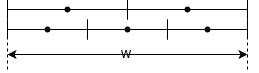
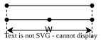

[torch.nn.functional.interpolate](https://docs.pytorch.org/docs/2.13/generated/torch.nn.functional.interpolate.html)

To do the interpolation, we need to:

1. Lift discrete input pixel indexing coordinates to a continuous space (continuous input pixel indexing coordinates).
2. Project discrete output pixel indexing coordinates to the continuous input pixel indexing coordinates.
3. Compute the values of the output pixel according to the projection.

WLOG, we only consider 1D interpolation, assuming that the **input size** (number of pixels) is $n_i$.

## Scaling by specifying target size $n_o$

`recompute_scale_factor` has no effect and no need in this case.

> Detailed explanation will be shown later, we can now summarize that the `recompute_scale_factor` only has effect when the expected scaling factor is different from the actual scaling factor. \
> While for the case scaling by specifying **target size** $n_o$ directly, expected and actual scaling factors are apparently the same.

### `align_corners=False`

The outer edges of the input/output corner pixels are aligned in this case, i.e. the **total physical size** are same, assuming which is $W$, the following figure shows the case when $n_i=2,n_o=3$:

> PyTorch treats every pixel a `1x1` square instead of an ideal point.

We have:

1. Per-pixel physical size:

   $$
   \begin{equation}
   w_k=\frac{W}{n_k} \label{eq:ppps}
   \end{equation}
   $$

   in which, $k\in\{i,o\}$, resulting $w_i$ and $w_o$ for input and output per-pixel physical size respectively.

2. Pixel distance between the left outer edge and the pixel centers:

   $$
   \begin{equation}
   l_k^{m_u} = 0.5 + x_k^{m_u} \label{eq:pd}
   \end{equation}
   $$

   in which, $u\in\{i,o\},m_u\in\{0,1,2,\dots\}$, $x$ is pixel index, resulting four possible combinations:
   - $l_i^{m_i}$: pixel distance of $m_i$-th input pixel under the input coordinate system;
   - $l_o^{m_i}$: pixel distance of $m_i$-th input pixel under the output coordinate system;
   - $l_i^{m_o}$: pixel distance of $m_o$-th output pixel under the input coordinate system;
   - $l_o^{m_o}$: pixel distance of $m_o$-th output pixel under the output coordinate system.

Combining equations $\eqref{eq:ppps}$ and $\eqref{eq:pd}$, we further have:

3. Physical distance between the left outer edge and the pixel centers:

   $$
   \begin{equation}
   d_k^{m_u}=l_k^{m_u}w_k
   \end{equation}
   $$

   Note that physical metric is independent of the pixel coordinate systems, which results:

   $$
   \begin{equation}
   d_i^{m_u} = d_o^{m_u}
   \end{equation}
   $$

To do the projection, we are interested in $l_i^{m_o}$, combinig the above equations, we have:

$$
\begin{aligned}
l_i^{m_o}
= \frac{d_i^{m_o}}{w_i} &= \frac{d_o^{m_o}}{w_i} \\
&= \frac{l_o^{m_o}w_o}{w_i} \\
&= (0.5+x_o^{m_o})\frac{n_i}{n_o} = 0.5+x_i^{m_o}
\end{aligned}
$$

which results in:

$$
\begin{equation}
x_i^{m_o}=(0.5+x_o^{m_o})\frac{n_i}{n_o}-0.5 \label{eq:saf}
\end{equation}
$$

and this is what we want: the continuous pixel index onto the input coordinates of the output pixel is a function of variables:

- $x_o^{m_o}$: output pixel index in the output coordinate space
- $n_i$: input size
- $n_o$: output size

### `align_corners=True`

The pixel centers of the corner pixels are aligned in this case, the pixel physical size model like above is not suitable anymore, pixels should be treated as ideal points instead, under such model, pixel intervals can be used in projection, and the corner pixel interval $W$ (in logical unit) is consistent in projection, e.g.

Similarly, we have:

1. Adjacent pixel interval:

   $$
   w_k=\frac{W}{n_k-1}
   $$

2. Pixel distance between the left-most pixel and the current pixel:

   $$
   l_k^{m_u} = x_k^{m_u}
   $$

3. Logical interval between the left-most pixel and the current pixel:

   $$
   d_k^{m_u}=l_k^{m_u}w_k
   $$

Then:

$$
l_i^{m_o} = \frac{l_o^{m_o}w_o}{w_i} = x_o^{m_o}\frac{n_i-1}{n_o-1} = x_i^{m_o}
$$

Finally:

$$
x_i^{m_o} = x_o^{m_o}\frac{n_i-1}{n_o-1}
$$

## Scaling by specifying scale factor $s$

Target size:

$$
\begin{equation}
n_o=\lfloor sn_i\rfloor
\end{equation}
$$

The situation when $sn_i=\lfloor sn_i\rfloor$ is tantamount to the first discussion "Scaling by specifying target size", but this is rare because $s$ can be arbitrary, it's most likely that $sn_i\neq\lfloor sn_i\rfloor$, which results in the actual scale factor $\frac{n_o}{n_i}$ is not equal to the given $s$.

### `align_corners=False`

Same mapping function as $\eqref{eq:saf}$, but result depends on the value of $n_o$:

- `recompute_scale_factor=False`: $n_o = sn_i$

  The size error is inevitable when determine target size, but we can use float size in index mapping to get accurate mapped indices, and therefore accurate interpolations.

- `recompute_scale_factor=True`: $n_o = \lfloor sn_i\rfloor$

  Compared to the above situation, one may be interested in this case if he want the interpolation fit the scaling result exactly.

The interpolation result difference of these two cases is caused by the lack of at most 1 pixel, so it's hard to notice in just one hundreds to thousands width/height image, but in deep learning, the stack architecture may enlarge the inconsistency of scale factor when `recompute_scale_factor=True`, and this is why PyTorch has chosen the default behavior as `recompute_scale_factor=False`.

### `align_corners=True`

Completely same as the analysis in config "scaling by specifying target size" and `align_corners=True` with $n_o=\lfloor sn_i\rfloor$.

`recompute_scale_factor` has to be `True` to fit the constraint `align_corners=True`.
